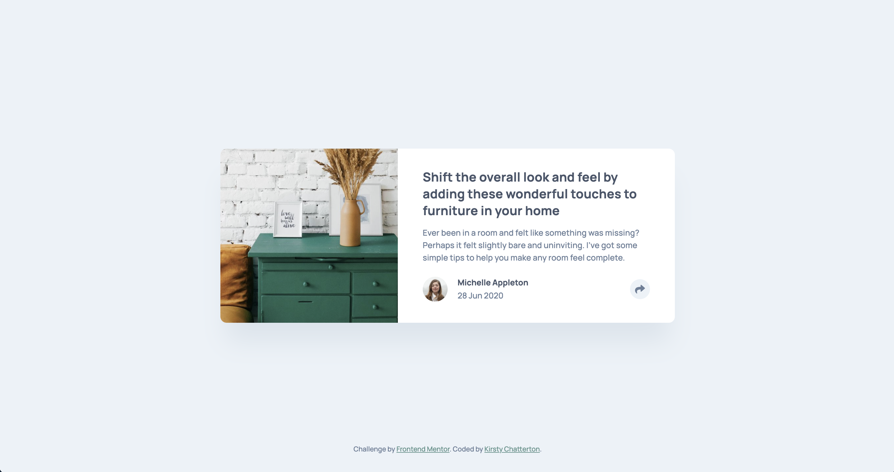

# Frontend Mentor - Article preview component solution

This is a solution to the [Article preview component challenge on Frontend Mentor](https://www.frontendmentor.io/challenges/article-preview-component-dYBN_pYFT). Frontend Mentor challenges help you improve your coding skills by building realistic projects.

## Table of contents

- [The challenge](#the-challenge)
  - [Screenshot](#screenshot)
  - [Links](#links)
- [Built with](#built-with)
- [Author](#author)

## The challenge

Users should be able to:

- View the optimal layout for the component depending on their device's screen size
- See the social media share links when they click the share icon

### Screenshot

### Links

- Solution URL: [https://www.frontendmentor.io/solutions/solution-for-article-preview-component-yfBcJNbW9](https://www.frontendmentor.io/solutions/solution-for-article-preview-component-yfBcJNbW9)
- Live Site URL: [https://kirstchat.github.io/article-preview-component/](https://kirstchat.github.io/article-preview-component/)

## Built with

- Semantic HTML5 markup
- CSS custom properties
- Flexbox
- Mobile-first workflow

## Author

- Frontend Mentor - [@KirstChat](https://www.frontendmentor.io/profile/KirstChat)
- LinkedIn - [Kirsty Chatterton](https://www.linkedin.com/in/kirsty-c-154781a4/)
